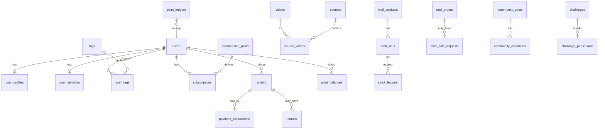

# Clean Circle · PostgreSQL 数据库草案

> **依据**：`docs/admin-api-spec.md` + 原型 B01–B51  
> **约定**：`snake_case`；金额 `bigint` 分；时间 `timestamptz`；软删 `deleted_at`；流水表只追加  
> **日期**：2026-08-10

---

## 1. Schema 划分

| Schema | 用途 |
|--------|------|
| `public` / `core` | 用户、内容、交易、商城、社区、配置 |
| `analytics` | 埋点与预聚合（或独立 ClickHouse） |
| `admin` | 后台账号、角色、审计（可合并进 core） |

下文表名默认在 `public`。

---

## 2. ER 总览（核心关系）

---

## 3. 系统与后台

### `admin_users`

| 列 | 类型 | 说明 |
|----|------|------|
| id | bigserial PK | |
| username | varchar(64) UNIQUE | |
| password_hash | text | |
| totp_secret_enc | text | 加密 |
| status | varchar(16) | active/locked |
| failed_login_count | int | |
| locked_until | timestamptz | |
| created_at / updated_at | timestamptz | |

### `admin_roles` / `admin_permissions` / `admin_role_permissions` / `admin_user_roles`

权限点建议：`module:action`，如 `users:read`、`users:sensitive`、`finance:export`、`points:approve`。

### `audit_logs`

| 列 | 类型 | 说明 |
|----|------|------|
| id | bigserial PK | **不可删除**（H-10） |
| admin_id | bigint | |
| module | varchar(64) | |
| action | varchar(64) | |
| object_type / object_id | varchar | |
| before_json / after_json | jsonb | |
| ip | inet | |
| result | varchar(16) | |
| created_at | timestamptz | |

索引：`(module, created_at DESC)`、`(object_type, object_id)`、`(admin_id, created_at DESC)`

### `idempotency_keys`

| 列 | 类型 |
|----|------|
| key | varchar(128) PK |
| scope | varchar(64) |
| response_hash | text |
| created_at | timestamptz |
| expires_at | timestamptz |

---

## 4. 用户与 CRM

### `users`

| 列 | 类型 | 说明 |
|----|------|------|
| id | bigserial PK | 对外 user_id |
| username | varchar(64) | |
| status | varchar(16) | normal/banned/deleted |
| register_channel | varchar(32) | |
| registered_at | timestamptz | 「新增用户」口径 |
| last_login_at / last_active_at | timestamptz | |
| app_version | varchar(32) | |
| device_type | varchar(16) | ios/android |
| timezone | varchar(64) | 打卡日切用 |
| legacy_user_id | varchar(64) | 迁移原 ID，幂等键 |
| created_at / updated_at / deleted_at | | |

索引：`registered_at`、`last_active_at`、`legacy_user_id UNIQUE NULLS NOT DISTINCT`

### `user_profiles`

昵称、头像 URL、展示名等非敏感字段。

### `user_sensitive`

| 列 | 类型 | 说明 |
|----|------|------|
| user_id | bigint PK FK | |
| phone_enc | bytea | 加密 |
| phone_hash | bytea | 检索用 HMAC |
| cycle_phase | varchar(16) | 月经/卵泡/排卵/黄体 |
| cycle_updated_at | timestamptz | |

### `tags` / `tag_categories` / `user_tags`

- `tags.type`：`system` \| `member` \| `cycle` \| `custom` \| `training`
- `user_tags`：`(user_id, tag_id)` UNIQUE；`source`（auto/manual/import）；`created_by`

### `user_segments` / `segment_rules`

- `rules_json`：条件组合 DSL
- `estimated_count`、`refreshed_at`

### `migration_batches` / `migration_items`

| batches | 说明 |
|---------|------|
| batch_no | 业务批次号 |
| is_canary | 灰度批（H-05 ≤50） |
| total / success / fail | |
| operator_id | |
| status | processing/success/partial/failed |

| items | 说明 |
|-------|------|
| phone_hash / legacy_user_id | 匹配键 |
| energy_balance | 必迁 |
| purchased_courses_json | 必迁 |
| result / fail_reason | |
| 幂等：`(legacy_user_id, batch_id)` UNIQUE |

---

## 5. 问卷与排课

### `quizzes` / `quiz_versions` / `quiz_questions` / `quiz_options`

- `quizzes.republish_days`：14 或 28
- `quiz_options` → `quiz_tag_mappings(option_id, tag_id, tag_kind)`  
  `tag_kind`：`user` \| `training`

### `quiz_submissions` / `quiz_results`

- 答案快照 JSON；结果话术版本 ID；无「长报告」实体（H-14）

### `schedule_rules` / `schedule_rule_versions`

- 条件组、硬性/软性、兜底；`status`：draft/pending_review/published/archived
- 审核人 ≠ 编辑人（应用层，H-04）

### `user_schedules` / `user_schedule_days`

- 一次生成今日起 30 天（H-02）
- `day_date`、`video_id`、`status`（planned/done/skipped/locked）
- 历史日锁定；重排只改未来

### `phase_tips`

周期阶段饮食/训练 Tips；审核与时效字段。

---

## 6. 内容与课程

### `videos`

| 列 | 类型 |
|----|------|
| id / code | |
| title / intro / cover_url | |
| calories_kcal | int |
| equipment_json | jsonb |
| status | draft/processing/ready/offline |
| duration_sec | int |
| storage_key | text |

### `video_playback_configs`

鉴权、链接 TTL、防盗链、动态水印开关。

### `video_tags` / `tag_rules` / `tag_review_queue`

- AI 建议 + Excel 同队列（H-03）
- `confidence`、`source`（ai/excel/manual）、`review_status`
- 安全标签必须终审（H-06）

### `courses` / `course_sections` / `course_videos` / `course_columns`

- 权益：`access_type` = free \| member \| points \| purchase \| permanent
- 状态：draft → pending_publish → published → offline
- `course_videos.sort_order`、`rest_sec`

### `user_course_entitlements`

用户已解锁课程；来源：购买/会员/能量值/活动/迁移。

---

## 7. 训练与能量值

### `training_sessions`

| 列 | 说明 |
|----|------|
| user_id, video_id, course_id | |
| progress_ratio | 0–1；≥阈值算完成 |
| completed | bool |
| started_at / ended_at | |
| feedback | 可选 |

### `checkin_records`

| 列 | 说明 |
|----|------|
| user_id, checkin_date | UNIQUE(user_id, checkin_date) |
| source_session_id | |
| streak_before / streak_after | |

日切：优先用户 `timezone`；统计报表用业务时区。

### `point_rules`

场景、单次奖励、日/周上限、活动窗、能量值 TTL、是否可重复、完课阈值。

### `point_balances`

`user_id` PK；`balance`；`updated_at` — **禁止直接 UPDATE 加减，必须经 ledger**

### `point_ledgers`（只追加）

| 列 | 说明 |
|----|------|
| user_id | |
| delta | 可负 |
| balance_after | |
| scene / rule_id | |
| ref_type / ref_id | |
| expires_at | |
| reverse_of_ledger_id | 冲正关联 |
| created_at | |

索引：`(user_id, created_at DESC)`

### `point_adjustment_requests`

B23：申请 → 审批 → 执行写 ledger；关联工单号/证据 URL。

---

## 8. 会员、订单与财务

### `membership_plans`

名称、类型 month/quarter/year、价格分、有效期天、自动续费、权益 JSON、上下架。

### `subscriptions`

| 列 | 说明 |
|----|------|
| user_id, plan_id | |
| status | trial/active/expiring/expired/renew_failed/cancelled_autorenew/refunded |
| channel | wechat/alipay/apple |
| started_at / expires_at | |
| autorenew | bool |
| next_renew_at | |
| apple_original_transaction_id | 等渠道主键 |

### `subscription_events`

状态变迁流水。

### `orders` / `order_items`

| orders 关键列 | 说明 |
|------------|------|
| order_no | UNIQUE |
| user_id | |
| order_type | membership/course/mall |
| amount_fen / paid_amount_fen | |
| status | pending_pay/paid/pay_failed/cancelled/refunding/refunded |
| channel | |
| paid_at | |

### `payment_transactions`

渠道流水号 UNIQUE；手续费；原始回调 JSON。

### `refunds` / `refund_events`

| 列 | 说明 |
|----|------|
| order_id | |
| amount_fen | |
| reason | |
| status | pending_review/…/succeeded/failed |
| source | admin \| apple_external \| user_app |
| channel | |

Apple 外退：`source=apple_external`，webhook 驱动。

### `finance_channel_records` / `reconciliation_batches` / `reconciliation_diffs`

三渠道对账；差异原因；结算周期。

---

## 9. 社区

### `community_posts` / `community_comments`

审核状态、展示开关、计数（阅/赞/评/藏）、置顶/推荐/精选。

### `community_official_contents`

专栏/单篇；话题标签；展示位置。

### `moderation_records` / `user_penalties`

机审命中规则、人审结论、处罚期限、解除时间。

### `reports` / `appeals`

举报/申诉材料；处理结果联动 posts 与 penalties。

### `challenges` / `challenge_participants` / `challenge_rewards`

目标类型、报名条件 JSON、进度、排名、奖励状态、异常标记。

### `placements`

资源位：位置、素材、跳转、人群、起止、CTR 指标可冗余日表。

---

## 10. 商城与售后

### `mall_products` / `mall_skus`

| skus | 说明 |
|------|------|
| sku_code | UNIQUE |
| cash_price_fen / points_price | |
| stock_current / stock_available / stock_locked | |
| stock_alert | |
| **约束**：available + locked = current（应用层维护） |

商品类型：`physical` \| `points` \| `cash` \| `points_and_cash`

### `stock_ledgers`（只追加）

`op`：in/out/lock/release/adjust/inventory；`quantity`；`ref_*`；`balance_*_after`；`idempotency_key` UNIQUE

### `mall_orders` / `mall_order_items` / `shipments` / `logistics_tracks`

订单状态：pending_pay → pending_ship → shipped → received → completed；旁路 cancelled / after_sale

### `after_sale_requests` / `after_sale_events`

| 列 | 说明 |
|----|------|
| after_sale_no | UNIQUE |
| mall_order_id | |
| type | return_refund / exchange / refund_only |
| status | 见 H-15 |
| refund_amount_fen / points_refund | |
| return_tracking_no | |
| receive_result | ok / damaged |

### `stock_reconciliation_batches` / `stock_reconciliation_items`

| items | 系统库存 / 锁定 / 实物盘点 / diff / reason / adjusted |

---

## 11. 消息与配置

### `message_templates` / `message_triggers` / `message_tasks` / `message_deliveries`

- deliveries：sent/arrived/opened/clicked + 失败原因 + 第三方回执
- 效果指标可从 deliveries 聚合或写入 `message_task_stats`

### `app_versions`

平台、latest、min_supported、force_update、文案、下载 URL、生效时间。

### `feature_flags`

key、enabled、灰度 JSON（platform/version/segment/time）。

### `announcements`

标题、正文、图、跳转、人群、时间、频率、状态。

### `third_party_service_configs`

服务名、状态、心跳、**密钥密文**、不返回明文。

### `support_configs`

企微二维码 `file_id` / URL；更新人/时间。

### `data_dictionary` / `metrics_definitions`

状态枚举与附录 B 口径说明（B02 抽屉）。

---

## 12. 分析（`analytics` schema）

### `analytics.events`

| 列 | 说明 |
|----|------|
| id | bigserial / UUID |
| user_id | nullable（未登录） |
| event_name | |
| props | jsonb |
| channel / app_version | |
| event_time | timestamptz |
| ingested_at | |

索引：`(event_name, event_time)`、`(user_id, event_time)`  
**生产建议**：冷热分离或 ClickHouse；PG 仅保留近 N 天。

### `analytics.daily_metrics`

日切预聚合：新增用户、DAU、训练、收入等 → B02/B49。

### `analytics.funnel_snapshots`

B48 台阶人数与转化率快照。

### `analytics.retention_cohorts`

注册日 cohort × D1/D7/D30 → B50。

---

## 13. 关键索引与约束清单

| 表 | 索引/约束 |
|----|-----------|
| users | phone 在 sensitive；legacy_user_id UNIQUE |
| orders | order_no UNIQUE；`(user_id, created_at)` |
| payment_transactions | channel_txn_id UNIQUE |
| point_ledgers | `(user_id, created_at)`；禁止 UPDATE/DELETE（角色权限） |
| stock_ledgers | idempotency_key UNIQUE |
| checkin_records | `(user_id, checkin_date)` UNIQUE |
| subscriptions | apple_original_transaction_id |
| after_sale_requests | after_sale_no UNIQUE |
| audit_logs | 无删除策略；分区可按月 |

---

## 14. 状态机速查（附录 A）

| 领域 | 状态 |
|------|------|
| 虚拟订单 | pending_pay → paid \| pay_failed \| cancelled；refunding → refunded |
| 退款 | pending_review → approved \| rejected → processing → succeeded \| failed |
| 商城订单 | pending_pay → pending_ship → shipped → received → completed；cancelled \| after_sale |
| 售后 H-15 | pending → pending_review → approved\|rejected → … → completed；cancelled\|closed |
| 课程 | draft → pending_publish → published → offline |
| 会员用户 | trial \| active \| expiring \| expired \| renew_failed \| cancelled_autorenew \| refunded |
| UGC 审核 | pending → pass \| reject \| request_edit \| escalate |
| 迁移批次 | processing \| success \| partial \| failed |

---

## 15. 迁移与种子

- 工具：`golang-migrate`（或 goose）
- 首批 seed：`admin_roles` 权限树、`data_dictionary`、默认 `point_rules`、`membership_plans`、功能开关默认值
- 老用户：经 `migration_*` 写入 users + entitlements + point_ledgers（幂等，禁止余额直接覆盖）

---

## 16. 与 API 映射提示

| 域 | 主表 | Handler 包建议 |
|----|------|----------------|
| 用户 CRM | users, tags, segments, migration_* | `users` |
| 内容 | videos, courses | `content` |
| 训练能量 | training_sessions, checkin_*, point_* | `training` |
| 财务 | orders, subscriptions, refunds, finance_* | `finance` |
| 社区 | community_*, challenges, placements | `community` |
| 商城 | mall_*, stock_*, after_sale_* | `mall` |
| 分析 | analytics.* | `analytics` |
| 系统 | admin_*, audit_logs | `system` |

---

*表结构可按 sqlc 生成代码微调列类型；金额/流水/幂等三原则不要破。*
